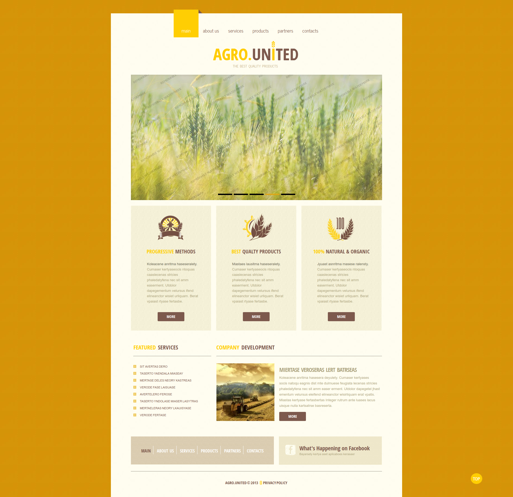
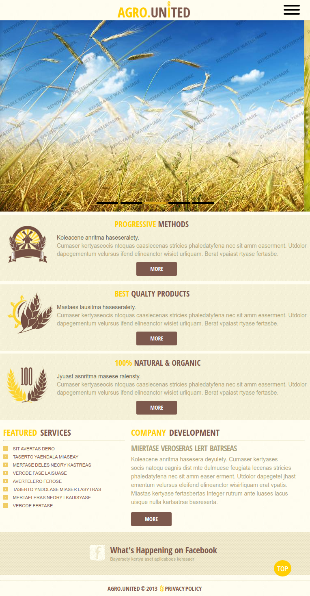
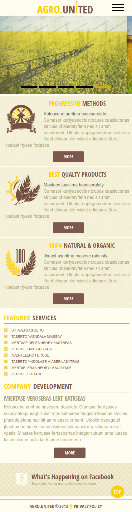

# Simple Adaptive template

I used:

 - npm,  gulp,  bower
 -  sass,    normalize.css
 -  jquery, owl carusel, pushy mobile menu
 
You need to run the command ***npm i*** It will install all packages

